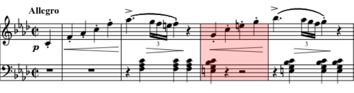

# 旋律写作技法

本篇主要记录有关旋律写作技法的音乐理论，可用于指导作曲/旋律生成。

## 基本旋律

### 音程旋律

#### 旋律进行

1. 同音重复。进行到相同的音高。
2. 级进进行。进行到二度的音高。
3. 小跳跳进进行。进行到三度的音高。
4. 大跳跳进进行。进行到三度以上的音高。

#### 旋律进行规则

1. 旋律大多在三度以内进行，即同音、级进、小跳可以大量使用。
2. 大跳进行需慎重。
3. 如果跳进幅度为六度或更高，在跳进后需要反向进行。

例如贝多芬的第一奏鸣曲第一乐章17小节中，旋律在向上进行一个大跳后改变行进方向，转而向下级进。

#### 参考规范

1. 音域应控制在一个半八度内
2. 级进和跳进应交替进行

### 旋律的发展趋势

#### 张力

旋律的进行主要靠张力的积累与释放来推动，音高和节奏都可以影响张力。

* 音高
  + 上升 积累张力
  + 下降 释放张力
  
* 节奏
  + 短音符 积累张力
  + 长音符 释放张力

例如贝多芬第一奏鸣曲第一乐章的开头，先通过连续、短促的音符上升积累张力，然后用长音符和下降进行释放张力，构成一条乐句。

#### 旋律进行的四种趋势

一段旋律一般都会保持在一个音域内，但旋律内部进行切分，每小段旋律的音高变化会呈现不同的趋势，这些趋势大致可以分为4种。

1. 上升进行 音符成上升趋势，积累张力。
2. 下降进行 音符成下降趋势，释放张力。
3. 交错进行 音符上下交错，维持在一个平稳的音域内，音高本身不会有大的张力变化，但可以通过节奏的改变影响张力。
4. 静止进行 音高保持不变，仅有节奏变化。不常见，但会有一些巧妙的使用。

一般来说，上述4种趋势需要交替构成一段旋律，长时间维持某一趋势会导致旋律过于无趣。

### 乐句

乐句是由 **展示部** 和 **发展部** 构成的，完整的八小节音乐 **[主题](#主题)** ，它必须以 **终止** 结尾。

#### 展示部

一个乐句的前4小节。在展示部中需要使用2小节展示一个乐思，即一段旋律，并对其进行2小节的重复。

重复的方法包括

1. 严格重复 和声和旋律都进行重复
   - 旋律和和声都与之前完全一致
   - 在原有旋律基础上少量调整部分音的音高
   - 保持原有旋律听感基本不变的前提下对原有旋律进行少量修改
2. 模进重复 旋律和和声平移相同音程
   - 严格模进 平移后的旋律音之间音程关系和之前完全一致，可能不在调内
   - 变化模进 平移后的旋律在调内，只要求平移的度一致，不要求大/小/纯，更常见
3. 应答重复 和声旋律和之前构成问答的感觉。前2小节在主和弦上，后2小节在属和弦上，并移调到属调，是最常用的一种重复。

仍然以贝多芬f小调第一奏鸣曲第一乐章的开头4小节为例，前2小节在Fm主和弦上，后2小节在C7属和弦上，两段旋律构成应答重复。

#### 发展部

一个乐句的后4小节。在发展部中需要发展展示部中的旋律，打破原有的重复，展现新意，并在最后进行终止。

发展的方法包括

1. 旋律加速 缩短旋律整体的时值，加速旋律，剩余空间填充新旋律
2. 和声加速
3. 模进进行 和[展示部](#展示部)中使用的模进技术相同，但是要注意这里不是为了重复而是为了发展，需要一些不同的听感
4. 碎片化 从展示部旋律中的乐思取出一个片段进行重复和发展
5. 特征去除 用于结束乐句，使用新的、没有先前特征的旋律（也就是AABC里的C）

展示-重复-发展-终止的曲式属于AABC的结构

贝多芬第一奏鸣曲第一乐章开头的乐句就是以上提到的结构，首先前4小节为展示部，每两小节为一段，进行应答重复；之后4小节为发展部，使用碎片化，截取展示部2小节乐思的后一个小节，做出少量变化，并且又做了一个应答重复；最后2小节使用特征去除结束整个乐句。

### 主题

主题是一个音乐单元，也就是说音乐由很多主题构成。