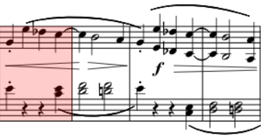

# 旋律写作技法

本篇主要记录有关旋律写作技法的音乐理论，可用于指导作曲/旋律生成。

## 基本旋律

### 音程旋律

#### 旋律进行

1. 同音重复。进行到相同的音高。
2. 级进进行。进行到二度的音高。
3. 小跳跳进进行。进行到三度的音高。
4. 大跳跳进进行。进行到三度以上的音高。

#### 旋律进行规则

1. 旋律大多在三度以内进行，即同音、级进、小跳可以大量使用。
2. 大跳进行需慎重。
3. 如果跳进幅度为六度或更高，在跳进后需要反向进行。

例如贝多芬的第一奏鸣曲第一乐章17小节中，旋律在向上进行一个大跳后改变行进方向，转而向下级进。

#### 参考规范

1. 音域应控制在一个半八度内
2. 级进和跳进应交替进行

### 旋律的发展趋势

#### 张力

旋律的进行主要靠张力的积累与释放来推动，音高和节奏都可以影响张力。

* 音高
  + 上升 积累张力
  + 下降 释放张力
  
* 节奏
  + 短音符 积累张力
  + 长音符 释放张力

例如贝多芬第一奏鸣曲第一乐章的开头，先通过连续、短促的音符上升积累张力，然后用长音符和下降进行释放张力，构成一条乐句。

#### 旋律进行的四种趋势
一段旋律一般都会保持在一个音域内，但旋律内部进行切分，每小段旋律的音高变化会呈现不同的趋势，这些趋势大致可以分为4种。

1. 上升进行 音符成上升趋势，积累张力。
2. 下降进行 音符成下降趋势，释放张力。
3. 交错进行 音符上下交错，维持在一个平稳的音域内，音高本身不会有大的张力变化，但可以通过节奏的改变影响张力。
4. 静止进行 音高保持不变，仅有节奏变化。不常见，但会有一些巧妙的使用。

一般来说，上述4种趋势需要交替构成一段旋律，长时间维持某一趋势会导致旋律过于无趣。
